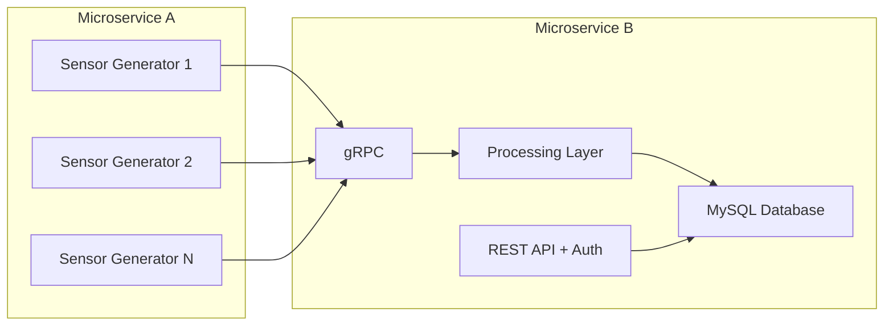
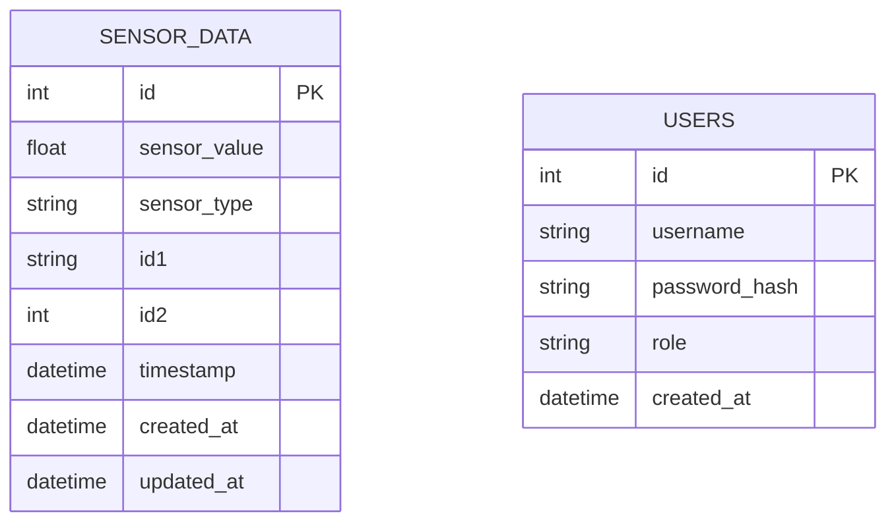

# datastream-backend

A backend system for **data streaming and sensor processing** built with **Go**, **Echo Framework**, **MySQL**, and a **Microservice Architecture**.  

This project simulates a platform that receives sensor data from multiple sources, stores them in a database, and exposes REST APIs for **visualization, analytics, and management**.

---

## ✨ Features

- **Microservice A**  
  - Generates a continuous data stream in the following format:
    ```json
    {
      "sensor_value": float,
      "sensor_type": string,
      "id1": string (capital letters),
      "id2": int,
      "timestamp": datetime
    }
    ```
  - Frequency of data generation can be configured via REST API.
  - Multiple instances can be created, each fixed to a single sensor type.

- **Microservice B**  
  - Receives data from Microservice A via **gRPC** or **MQTT**.  
  - Compiles and stores data in **MySQL**.  
  - Provides REST API for:
    - 🔍 Retrieve data by ID1/ID2  
    - ⏰ Retrieve data by timestamp/duration  
    - 🔄 Retrieve data by combined ID and timestamp filters  
    - 🗑️ Delete data (based on filters)  
    - ✏️ Edit data (based on filters)  
    - 📖 Pagination for large datasets  

- **Authentication & Authorization**  
  - JWT-based security for all API endpoints.  

- **Scalability**  
  - Supports many Microservice A instances simultaneously.  
  - Microservice B can scale horizontally to handle high loads.  

- **Documentation & Tools**  
  - Swagger API Documentation  
  - Postman Collection (JSON included)  
  - Dockerized using `docker-compose`  
  - Clean Architecture  

---

## 🏗️ Architecture

### Clean Architecture
- **Domain Layer** → Entities & business rules  
- **Use Case Layer** → Application logic  
- **Interface Layer** → gRPC, MQTT, REST API (Echo)  
- **Infrastructure Layer** → Database (MySQL), external services  

### Schematic Diagram


---

## 🗄️ Database Design (ERD)



---

## 🚀 Getting Started

### Prerequisites
- Go 1.22+  
- Docker & Docker Compose  
- MySQL 8+  

### Installation

```bash
# clone repository
git clone https://github.com/<your-username>/datastream-backend.git
cd datastream-backend

# build & run with docker
docker-compose up --build
```

### Configuration
Create a `.env` file:
```env
DB_DSN=root@tcp(127.0.0.1:3306)/datastream?parseTime=true
JWT_SECRET=supersecret
PORT=8080
GRPC_PORT=50051
```

---

## 📚 API Documentation

- Swagger UI → `http://localhost:8080/swagger/index.html`  
- Postman Collection → available in `/postman/datastream.postman_collection.json`  

---

## 🔑 Authentication
Use **JWT token** for protected endpoints.  
Example header:
```http
Authorization: Bearer <your_token>
```

---

## 🧪 Testing

```bash
# run unit tests
go test ./...
```

---

## 📦 Deployment

1. Run services using `docker-compose`  
2. (Optional) Add **NGINX Load Balancer** + **Auto-scaling** with Kubernetes or Docker Swarm  

---

## 📈 Scalability & Performance
- Multiple **Microservice A** instances → each representing one sensor type.  
- **Microservice B** can run multiple replicas for load balancing.  
- Supports high throughput by decoupling via gRPC/MQTT.  

---

## 🛠️ Tools & Libraries
- [Go](https://go.dev/)  
- [Echo Framework](https://echo.labstack.com/)  
- [MySQL](https://www.mysql.com/)  
- [gRPC](https://grpc.io/) / [MQTT](https://mqtt.org/)  
- [Docker](https://www.docker.com/)  
- [Swagger](https://swagger.io/)  
