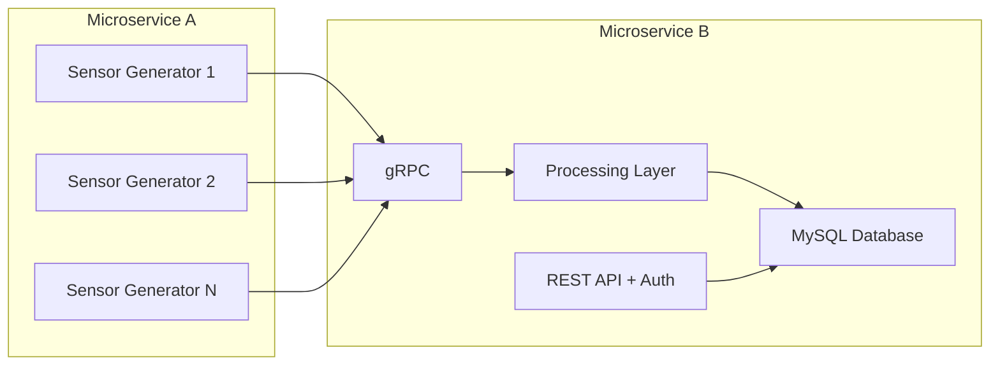
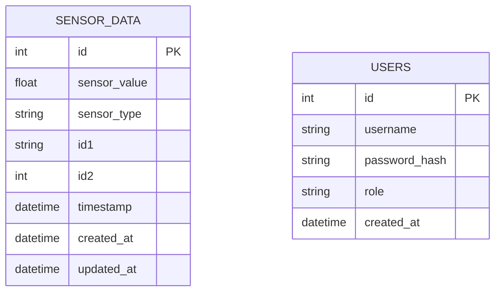

# Architecture & ERD

### Schematic Diagram

```mermaid
flowchart LR
    subgraph A[Microservice A]
        A1[Sensor Generator 1]
        A2[Sensor Generator 2]
        A3[Sensor Generator N]
    end

    subgraph B[Microservice B]
        B1[gRPC]
        B2[Processing Layer]
        B3[MySQL Database]
        B4[REST API + Auth]
    end

    A1 --> B1
    A2 --> B1
    A3 --> B1
    B1 --> B2 --> B3
    B4 --> B3
```

## 🗄️ Database Design (ERD)

```mermaid
erDiagram
    SENSOR_DATA {
        int id PK
        float sensor_value
        string sensor_type
        string id1
        int id2
        datetime timestamp
        datetime created_at
        datetime updated_at
    }

    USERS {
        int id PK
        string username
        string password_hash
        string role
        datetime created_at
    }
```
